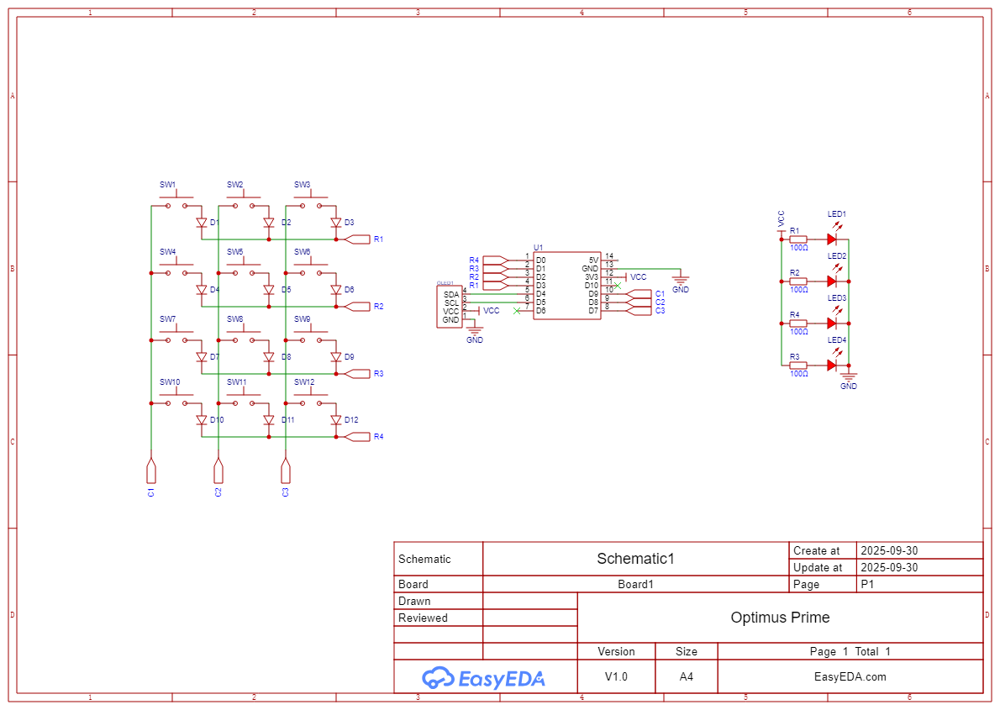

# Truck Macropad

A Truck disguised as a 12 keys Macropad, featuring a XIAO RP2040, 0.91inch OLED display and uses KMK firmware.

## Features

-   12 MX Style Switches
-   4 LEDs
-   0.91 inch Display
-   Unique Case Design

## Schematic

## PCB

## Case

